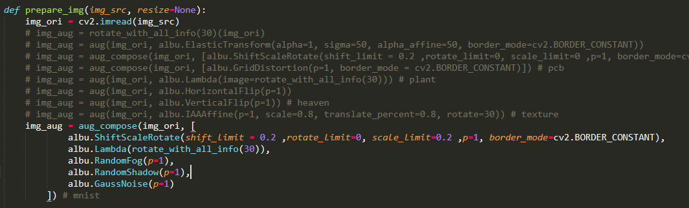
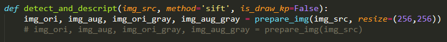
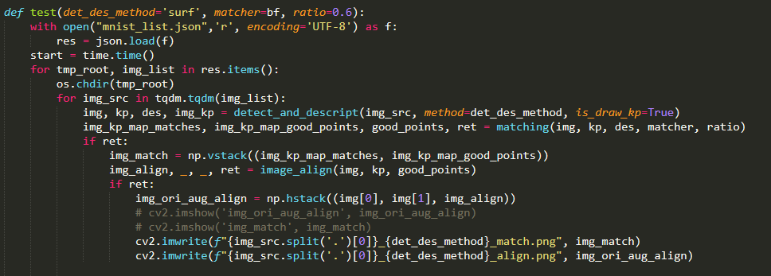
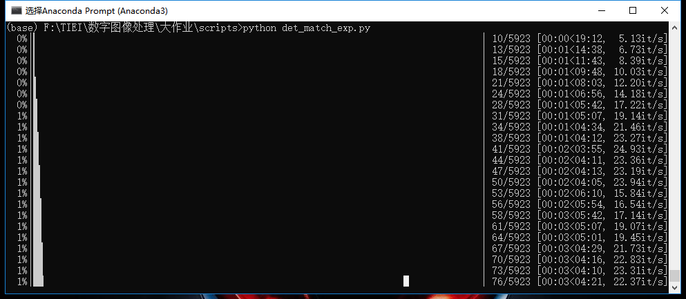

# digital_image_processing
Digital Image Processing course in TIEI, Tianjin University 


## CONTENT

[图像增强](data_aug_exp.md)

[图像配准](det_match_exp.md)


## 脚本使用

### 1. [data_aug.py](./data_aug.py)

#### 1.1 单一数据增强

```python
from data_aug import *
img_vflip = aug(img.copy(), albu.VerticalFlip(p=1))
```

#### 1.2 多种数据增强

```python
from data_aug import *
img_aug = aug_compose(img.copy, [
			albu.ShiftScaleRotate(shift_limit = 0.2 ,rotate_limit=0, 
                                  scale_limit=0.2 ,p=1, border_mode=cv2.BORDER_CONSTANT),
			albu.Lambda(rotate_with_all_info(30)),
			albu.RandomFog(p=1),
			albu.RandomShadow(p=1),
			albu.GaussNoise(p=1)
		])
```

#### 1.3  增强并显示

```python
from data_aug import *
aug_show(img.copy(), albu.OpticalDistortion(distort_limit=0.25, shift_limit=0.25, border_mode= cv2.BORDER_CONSTANT, p=1), 'optical_distortion')
```

### 2. [det_match_exp.py](./det_match_exp.py)

1. 首先建立工程文件夹，在文件夹内新建 `dataset`文件夹，并将数据集放入其中；然后为数据集生成图片列表，并将其存入json文件中，如文件[mnist_list.json](./mnist_list.json)所示。
2. 修改需要的数据增强策略，如下图所示：



3. 是否 `resize` 图像, 修改 `resize`大小



4. 修改 `test`函数参数， 加载图像列表 json 对象。



**参数设置** 

- `det_des_method` 为 `['sift', 'surf', 'orb', 'brief'] 中任意一个
- `matcher` 为 [bf, flann] 中任意一个
- `ratio`  挑选good matches 的比率，挑选原则是 `m.distance < ratio * n.distance`，其中`m`是最临近的`match point`, `n`是次临近的`match point`。如果最终`good matches`的点比较少，可以适当调大`ratio`

> 注意： flann 只适用于 sift 和 surf

## 运行截图

