# 图像配准

## 实验环境： 

- windows10 + python3.7.4 + opencv-contrib-python 3.4.2.17 + albumentations 0.4.5
- 处理器： i7-6700HQ 2.6HZ，四核八线程
- 内存： 16GB

## 1. 耗时对比

***TIME CONSUMED***

实验数据为 `mnist` 数据集， 并将其重新调整大小 `256*256`。

- `detectors and descriptors : SIFT, SURF, ORB, STAR + BRIEF`
- `matchers: BRUTE-FORCE, FLANN(Fast Library for Approximate Nearest Neightbors)`

|              | BRUTE-FORCE |  FLANN  |
| :----------: | :---------: | :-----: |
|     SIFT     |  606.758 s  | 678.236 |
|     SURF     |  515.923 s  | 576.093 |
|     ORB      |  292.548 s  |    -    |
| STAR + BRIEF |  258.984 s  |    -    |

> FLANN 只能适用于 `SIFT , SURF`

## 2. 图像配准

### 2.1 医学图像

***数据增强方式： 弹性形变(ElasticTransform)***

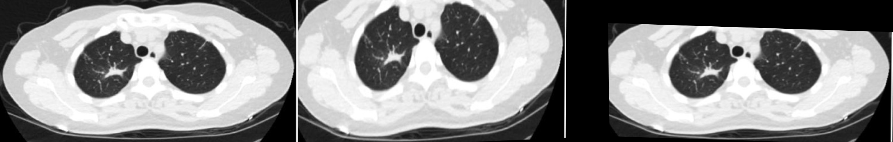

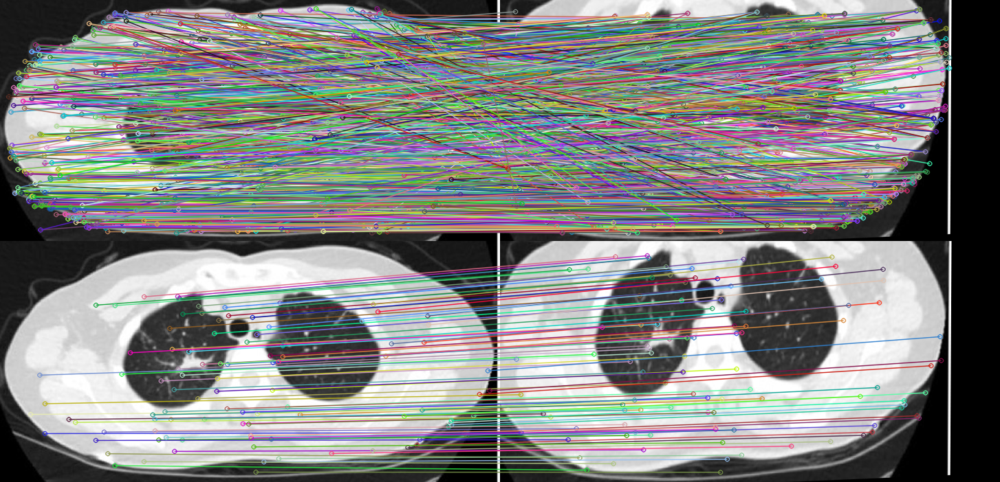

### 2.2 自然场景

#### 2.2.1. 高空摄影(雾)

***数据增强方式： 垂直翻转***

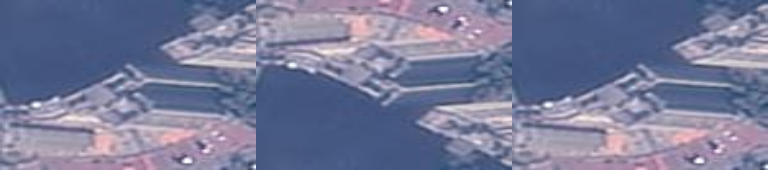

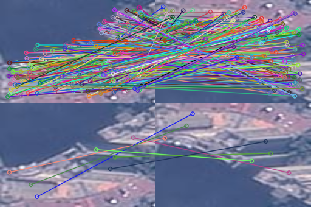

#### 2.2.2. 地面摄影(正常场景)

***数据增强方式： 水平翻转***

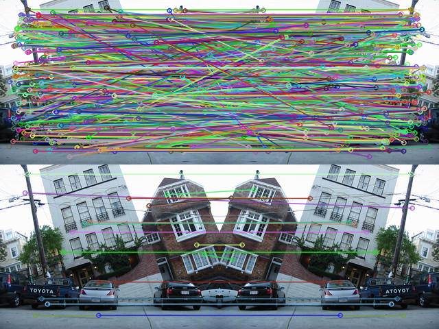

#### 2.2.3. 水下摄影(雾)

***数据增强方式： 平移***

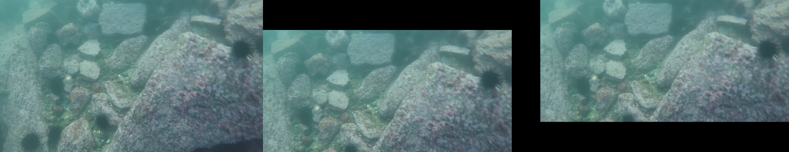

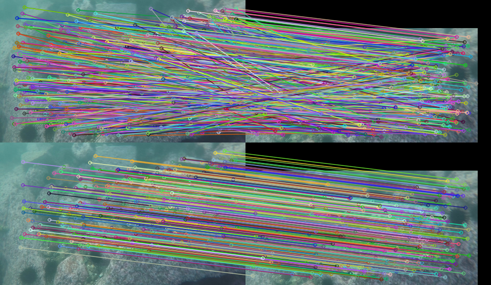

#### 4. 自然纹理(纹理特征)

***数据增强方式： 仿射变换***

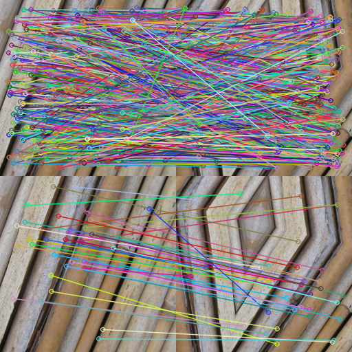

#### 2.2.5. 植物病理(阴影)

***数据增强方式： 旋转***

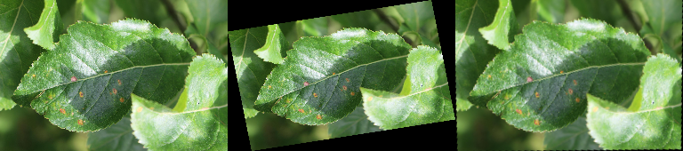

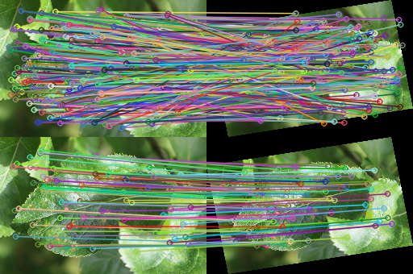

### 2.3 工业图像

***数据增强方式： 网格畸变(GridDistortion)***

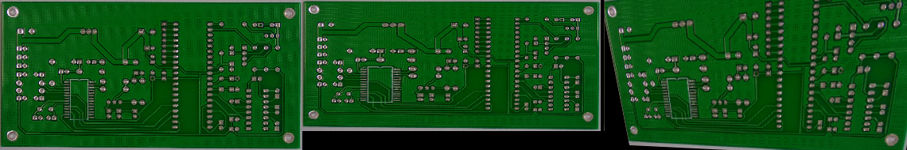

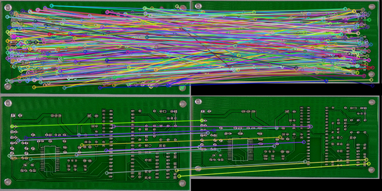

### 2.4 mnist

***数据增强方式：平移 + 缩放 + 旋转 + 雾化 + 阴影 + 高斯噪声***

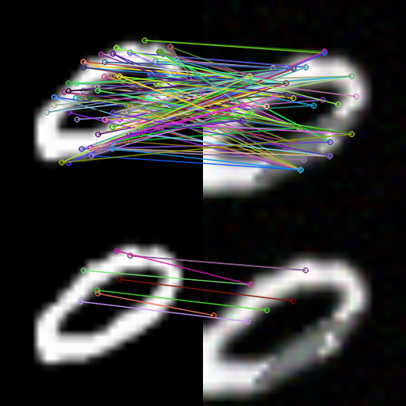

## 3. 数据集

`医学图像` ：[COVID-CT](https://github.com/mmmmmmiracle/COVID-CT/tree/master/Images-processed)

`自然场景` ：

- [城市区域分布](./data/city_area.zip) `数据现在已不开放下载，在此选取了其中200张`
- [ICCV09DATA](./data/iccv09Data.tar.gz)
- [UNDER WATER](https://www.kesci.com/u/7a6126)
- [TEXTURE](https://www.kesci.com/home/dataset/5e903545e7ec38002d015fbb/files)
- [PLANT](https://www.kesci.com/home/dataset/5e870dc995b029002ca84507/files)

`工业图像` ：

- [PCB](https://www.dropbox.com/s/32kolsaa45z2mpj/PCB_DATASET.zip?dl=0)

`MNIST`    : [MNIST](https://www.kesci.com/home/dataset/58a7c84c803d1a0d2e26441a/files)

## 4. References

### OPENCV DOC

[Feature Detection and Description](https://docs.opencv.org/3.4/db/d27/tutorial_py_table_of_contents_feature2d.html)

[Feature Matching](https://docs.opencv.org/3.4/dc/dc3/tutorial_py_matcher.html)

[Feature Matching + Homography to find Objects](https://docs.opencv.org/3.4/d1/de0/tutorial_py_feature_homography.html)

### BLOG

[SIFT图像匹配技术详细指南](https://www.toutiao.com/a6761245533257335308/?tt_from=copy_link&utm_campaign=client_share&timestamp=1580023344&app=news_article&utm_source=copy_link&utm_medium=toutiao_ios&req_id=202001261522240101310751954C145EE9&group_id=6761245533257335308)

[Python进行SIFT图像对准](https://www.jianshu.com/p/f1b97dacc501)

[特征点检测：Harris, SIFT, SURF, ORB](https://zhuanlan.zhihu.com/p/36382429)

[图像配准算法大总结](https://blog.csdn.net/gaoyu1253401563/article/details/80631601)

### PAPER

[SIFT](./papers/sift.pdf)

[SURF](./papers/surf.pdf)